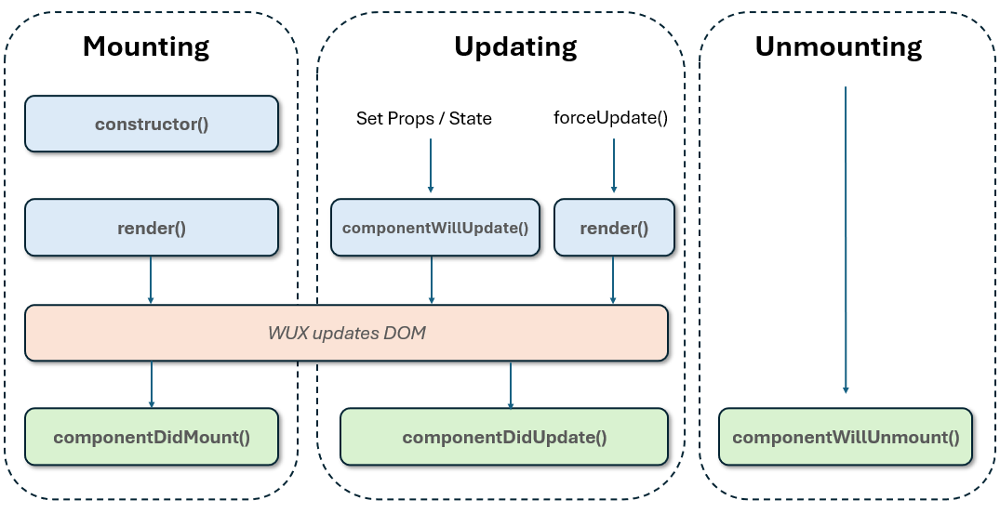

# WUX - Wrapped User Experience ver. 2 &middot; [](https://opensource.org/licenses/Apache-2.0) 

A Javascript library to build component based user interface.

The project was born from a long experience in the development of portals in the public sector, particularly in the Italian market where the [Bootstrap Italia](https://italia.github.io/bootstrap-italia) theme is recommended by [AGID](https://www.agid.gov.it).

The main idea was to support the development of modern web applications based on the preferred theme and components in some cases imposed by the guidelines without using more difficult to customize frameworks.

The **WUX** library is inspired by [React](https://react.dev) for component lifecycle management, but is designed to be more 
- **lightweight**, 
- **flexible**, 
- **easy-to-use**.

By installing Typescript globally there are no additional direct dependencies. In other words, **you no longer have to deal with large node_modules directories**.

**JQuery** is supported, but NOT required.

It is also suitable for writing microfrontends with [single-spa](https://single-spa.js.org/) (see the [micro-wux](https://github.com/giosil/micro-wux) repository).

[See a sample application.](samples/)

## Build

- `git clone https://github.com/giosil/wux.git`
- `npm install typescript -g`
- `npm install uglify-js -g`
- `npm run build`

## Examples

The simplest example of WUX.WComponent is as follows:

```typescript
namespace APP {
  export class Main extends WUX.WComponent {
    protected render() {
      return '<div>Hello World!</div>';
    }
  }
}
```

The **render()** method can also return an HTML element.

```typescript
namespace APP {
  export class Main extends WUX.WComponent {
    protected render() {
      let ele = document.createElement('div');
      ele.textContent = 'Hello World!'
      return ele;
    }
  }
}
```

Finally, the **render()** method can also return an instance of WUX.WComponent.

```typescript
namespace APP {
  export class Main extends WUX.WComponent {
    protected render() {
      return new WUX.Wrapp('Hello World!', 'div');
    }
  }
}
```

This way you can develop a view by composing strings, elements and instances of WUX.WComponent.

To mount a view, simply write:

```html
<!DOCTYPE html>
<html>
  <head>
    <title>WUX ver. 2.0.0</title>
  </head>
  <body>
    <div id="view-root"></div>

    <script src="dist/wux.min.js"></script>
    <script src="dist/app.min.js"></script>
    <script type="text/javascript">
        WuxDOM.render(new APP.Main(), 'view-root');
    </script>
  </body>
</html>
```

## Documentation

The methods that can be implemented in **WUX**, as in React, to control the behavior of components are listed below.

<table>
<tr><td>The <strong>constructor()</strong> method is called when the component is first created. You use it to initialize the component's state and bind methods to the component's instance.</td></tr>
<tr><td>The <strong>render()</strong> method is responsible for generating the component's DOM representation based on its current props and state. It is called every time the component needs to be re-rendered, either because its props or state have changed, or because a parent component has been re-rendered.</td></tr>
<tr><td>The <strong>componentDidMount()</strong> method is called once the component has been mounted into the DOM. It is typically used to set up any necessary event listeners and perform other initialization tasks that require access to the browser's DOM API.</td></tr>
<tr><td>The <strong>shouldComponentUpdate()</strong> method is called before a component is updated. This method returns a boolean value that determines whether the component should update or not. If this method returns true, the component will update, and if it returns false, the component will not update.</td></tr>
<tr><td>The <strong>componentWillUpdate()</strong> method is called just before a component's update cycle starts. It allows you to perform any necessary actions before the component updates.</td></tr>
<tr><td>The <strong>componentDidUpdate()</strong> method is called after a component has been updated and re-rendered. It is useful for performing side effects or additional operations when the component's props or state have changed.</td></tr>
<tr><td>The <strong>componentWillUnmount()</strong> method is called just before the component is removed from the DOM. It allows you to perform any necessary cleanup or clearing any data structures that were set up during the mounting phase.</td></tr>
</table>



Additional methods and properties are listed below.

<table>
<tr><td>The <strong>updateState(nextState: S)</strong> method is called when the <strong>state</strong> needs to be updated.</td></tr>
<tr><td>The <strong>updateProps(nextProps: P)</strong> method is called when the <strong>props</strong> needs to be updated.</td></tr>
<tr><td>The <strong>buildRoot, build, make</strong> methods are called in **render** default implementation.</td></tr>
<tr><td>The <strong>on, off, trigger</strong> methods allow you to handle events provided by the DOM or custom events (the event name begins with an underscore).</td></tr>
<tr><td>The <strong>style, classStyle, attributes</strong> properties allow you to characterize the component in terms of presentation.</td></tr>
<tr><td>The <strong>visible, enabled</strong> properties allow you to respectively make the component visible or not and enable or disable it.</td></tr>
<tr><td>The <strong>focus(), blur()</strong> methods allow you to handle the focus on the component.</td></tr>
<tr><td>The <strong>forceUpdate()</strong> method forces the component to update.</td></tr>
<tr><td>The <strong>getRoot()</strong> method returns the root element of the component.</td></tr>
<tr><td>The <strong>getContext()</strong> method returns the element on which the component was mounted.</td></tr>
</table>

## Wrapper like components

In WUX a component is effectively a wrapper.

In addition to the development model, WUX offers some ready-to-use wrappers that are frequently used in web applications.

Below are some of the more relevant wrappers.

### WUX.WContainer

**WContainer** allows you to implement the layout of a component.

```typescript
this.main = new WUX.WContainer();
this.main
  .addRow()
    .addCol('col-md-12')
      .add(this.form)
  .addRow()
    .addCol('col-md-8')
      .addGroup({"classStyle": "form-row"}, this.btnFind, this.btnReset)
    .addCol('col-md-4', {a : 'right'})
      .addGroup({"classStyle": "form-row"}, this.btnNew)
  .addRow()
    .addCol('col-md-12', 'padding-top: 1rem;')
      .add(this.table);
```

### WUX.WForm

**WForm** allows you to implement an HTML form.

```typescript
let options: WUX.WEntity[] = [
  {id: 'N', text: ''},
  {id: 'M', text: 'Male'}, 
  {id: 'F', text: 'Female'}
];

this.form = new WUX.WForm(this.subId('form'));
this.form
  .addRow()
    .addTextField('name', 'Name')
    .addOptionsField('gender', 'Gender', options, {"span": 2})
  .addRow()
    .addDateField('date', 'Date')
    .addTimeField('time', 'Time')
    .addBooleanField('flag', 'Flag');

// Validation
this.form.setMandatory('name', 'gender');

let returnLabels  = true;
let focusOn       = true;
let atLeastOne    = false;
let invalidFields = this.form.checkMandatory(returnLabels, focusOn, atLeastOne);
if(invalidFields) {
  alert('Check: ' + invalidFields);
  return;
}

// Utilities

// Clear all fields
this.form.clear();

// Enable / Disable a field
this.form.setEnabled('date', false);

// Set focus on a field
this.form.focusOn('name');

// Find option by text
this.form.findOption('gender', 'Male');

// Load options later
this.form.setOptions('gender', options);

// Set nested value
this.form.setValueOf('name', booking, 'person.name');

// Set single value
this.form.setValue('name', 'Jhon');

// Get single value
let name = this.form.getValue('name');
```

### WUX.WButton

**WButton** allows you to implement an HTML button and handle related events.

```typescript
this.btnFind = new WUX.WButton(
  this.subId('btnFind'),       // Element id
  'Search',                    // Caption
  'fa-search',                 // Icon
  'btn-icon btn btn-primary',  // Style class
  'margin-right: 0.5rem;'      // Inline style
);
this.btnFind.on('click', (e: PointerEvent) => {
  // Perform operation
});

this.btnReset = new WUX.WButton(
  this.subId('btnReset'),      // Element id
  'Cancel',                    // Caption
  'fa-undo',                   // Icon
  'btn-icon btn btn-secondary' // Style class
);
this.btnReset.on('click', (e: PointerEvent) => {
  this.form.clear();
  this.form.focus();
  this.table.setState([]);
});
```

### WUX.WLink

**WLink** allows you to implement an HTML link and handle related events.

```typescript
let fid  = 5;
let link = new WUX.WLink(
  this.subId('file-' + fid), // Element id
  'Link to file',            // Caption
  'fa-file',                 // Icon
  'text-primary',            // Style class
  'cursor:pointer;'          // Inline style
);
link.lock = true; // Inhibits state change (Caption)
link.tooltip = 'Download file';
link.on('click', (e: MouseEvent) => {
  let cid = WUX.getId(e.currentTarget);
  let fid = WUtil.toNumber(WUX.lastSub(cid));
  // Perform operation
});
```

### WUX.WInput

**WInput** allows you to implement an HTML input and handle related events.

```typescript
let input = new WUX.WInput(this.subId('inp'), 'text', 20);
input.placeHolder = 'Search...';
input.readonly = false;
input.enabled = true;
input.autofocus = true;
input.onEnter((e: KeyboardEvent) => {
  // Perform operation
});
```

### WUX.WSelect

**WSelect** allows you to implement an HTML select and handle related events.

```typescript
let options: WUX.WEntity[] = [
  {id: 'N', text: ''},
  {id: 'M', text: 'Male'}, 
  {id: 'F', text: 'Female'}
];

let select = new WUX.WSelect(this.subId('sel'));
select.setOptions(options);
select.on('statechange', (e: WUX.WEvent) => {
  console.log('sel statechange', e);
});

// Find option by text
let optM = select.findOption('Male');
```

### WUX.WLabel

**WLink** allows you to implement an HTML span or label (if "for" attribute setted).

```typescript
let label = new WUX.WLabel(
  this.subId('label'),    // Element id
  'Text',                 // Text
  'fa-circle-info',       // Icon
  'text-primary',         // Style class
  'margin-right: 0.5rem;' // Inline style
);
```

### WUX.WTable

**WTable** allows you to implement an HTML table.

```typescript
// Header captions
let h = ['Code', 'Name', 'View', 'Edit', 'Delete'];
// Header symbols
let k = ['code', 'name', '_v',   '_m',   '_d'];
this.table = new WUX.WTable(this.subId('tapp'), h, k);
this.table.selectionMode = 'single';
this.table.div = 'table-responsive';
this.table.types = ['s', 's', 'w', 'w', 'w'];
this.table.sortable = [0, 1];
// Click event
this.table.on('click', (e: PointerEvent) => {
  let a = WUX.getAction(e, this);
  if(!a || !a.ref) return;
  if(a.name == 'sort') return;
  let s = this.table.getState();
  let x = WUX.WUtil.indexOf(s, 'id', a.ref);
  if(x < 0) return;
  // Perform operation
});
// DoubleClick event
this.table.onDoubleClick((e: {element?: Element; rowElement?: Element; data?: any; rowIndex?: number; }) => {
  // Perform operation
});
// Selection event
this.table.onSelectionChanged((e: {element?: Element, selectedRowsData?: any[]}) => {
  let srs = this.table.getSelectedRows();     // array of selected indexes
  let srd = this.table.getSelectedRowsData(); // array of selected data
  // Perform operation
});
// RowPrepared event 
this.table.onRowPrepared((e: {element?: Element, rowElement?: Element, data?: any, rowIndex?: number}) => {
  let mark = e.data['mark'];
  if (mark) {
    WUX.setCss(e.rowElement, 'background-color: #ffffee');
  }
});

// Let "data" be an array containing the records to be displayed in the table
let data = [];
for(let r of data) {
  r["_v"] = WUX.action('view',   r["id"], 'fa-search');
  r["_m"] = WUX.action('edit',   r["id"], 'fa-edit');
  r["_d"] = WUX.action('delete', r["id"], 'fa-trash');
}

this.table.setState(data);
```

### WUX.WTab

**WTab** allows you to implement tabs and handle related events.

```typescript
this.tab = new WUX.WTab(this.subId('tab'));
this.tab.contStyle = 'height:400px;padding-top:24px;';
this.tab
  .addTab('Form', 'fa-edit')
    .add(this.form);
this.tab
  .addTab('Table', 'fa-list')
    .addRow()
      .addCol('col-10')
        .add(this.table)
      .addCol('col-2')
        .add(this.btnAdd)
        .addDiv(4)
        .add(this.btnRem)
        .addDiv(4)
        .add(this.btnUp)
        .add(this.btnDw);

this.tab.on('statechange', (e: WUX.WEvent) => {
  let index = this.tab.getState();
  // Perform operation
});
```

### WUX.WPages

**WPages** allows you to display one component at a time in a view.

```typescript
this.pages = new WUX.WPages();
this.pages
  .before(compBefore)
  .add(component0)
  .add(component1)
  .add(component2)
  .add(component3);

// Show dialog in same view
dialog.addToPages(this.pages, false);

// Show single page
this.pages.show(0);
```

### WUX.WDialog

**WDialog** allows you to implement modal dialogs.

```typescript
export interface Entity {
  id:    number;
  code?: string;
  name?: string;
}

export class DlgEntity extends WUX.WDialog<string, Entity> {
  form: WUX.WForm;

  constructor(id: string) {
    super(id, 'DlgEntity');
    
    this.title = 'Entity';

    this.form = new WUX.WForm(this.subId('form'));
    this.form.addRow();
    this.form.addTextField('code', 'Code');
    this.form.addRow();
    this.form.addTextField('name', 'Name');
    this.form.addInternalField('id');

    this.form.setMandatory('code', 'name')
    
    this.body
      .addRow()
        .addCol('col-md-12')
          .add(this.form);
  }

  override updateState(nextState: Entity): void {
    this.state = nextState;
    if(this.form) {
      this.form.clear();
      this.form.setState(this.state);
    }
  }

  override getState(): Entity {
    if(this.form) this.state = this.form.getState();
    return this.state;
  }

  override onClickOk(): boolean {
    if(this.props == 'new' || this.props == 'edit') {
      let m = this.form.checkMandatory(true, true);
      if(m) {
        showWarning('Check: ' + m);
        return false;
      }
    }
    return true;
  }

  protected onShown() {
    if(this.props == 'view') {
      this.form.enabled = false;
      this.updButtons('Close', '');
    }
    else {
      this.form.enabled = true;
      this.updButtons('Save');
      if(this.props == 'edit') {
        this.form.setReadOnly('code', true);
        setTimeout(() => { this.form.focusOn('name'); });
      }
      else {
        this.form.setReadOnly('code', false);
        setTimeout(() => { this.form.focusOn('code'); });
      }
    }
  }
}

// The Dialog is typically created in the constructor of component that manages it.
constructor() {
  super();
  this.dlg = new DlgEntity(this.subId('dlg'));
  // this.dlg.fullscreen = true;
  this.dlg.onHiddenModal((e: JQueryEventObject) => {
    if (!this.dlg.ok) return;
    // Perform operation
  }
}

// To show dialog
this.dlg.setProps(props);
this.dlg.setState(state);
this.dlg.show(this);
```

## SVG Logo

```xml
<?xml version="1.0" encoding="utf-8"?>
<svg viewBox="0 0 82 72" xmlns="http://www.w3.org/2000/svg">
  <text style="fill: rgb(0, 0, 0); font-family: Consolas; font-size: 50px;" x="0" y="40">{&#x00B5;}</text>
  <text style="fill: rgb(0, 0, 0); font-family: Consolas; font-size: 14px;" x="7" y="65">micro-wux</text>
</svg>
```

<table>
  <tr>
    <td></td>
    <td></td>
  </tr>
</table>

## License

[](https://opensource.org/licenses/Apache-2.0)

## Contributors

* [Giorgio Silvestris](https://github.com/giosil)
